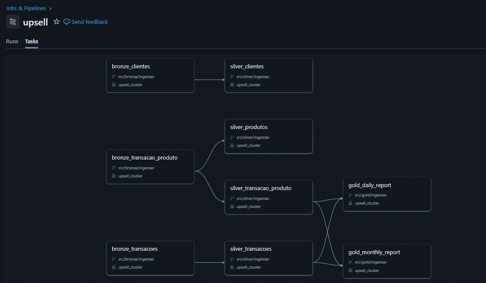
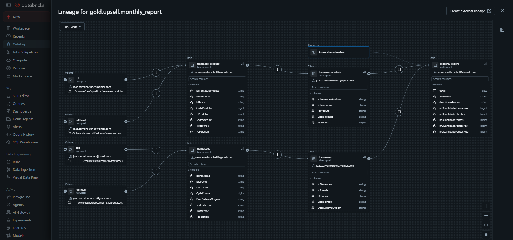
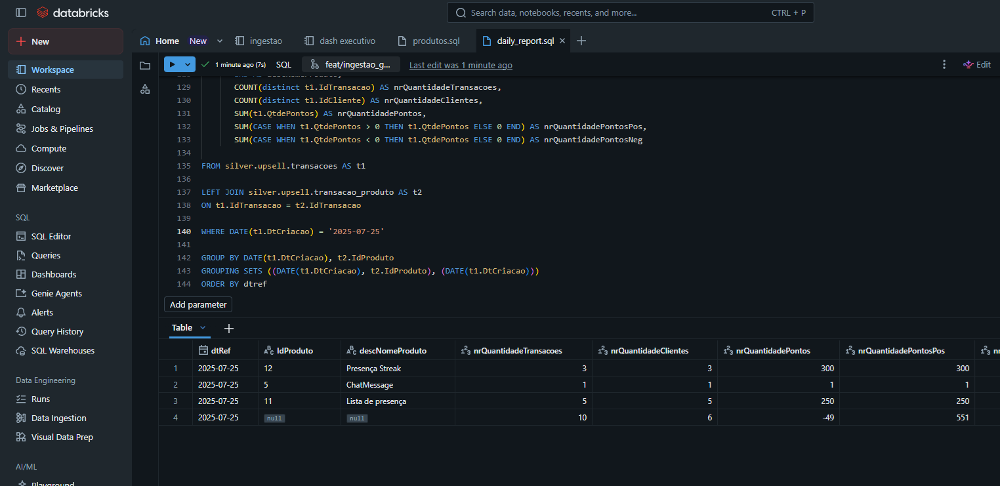
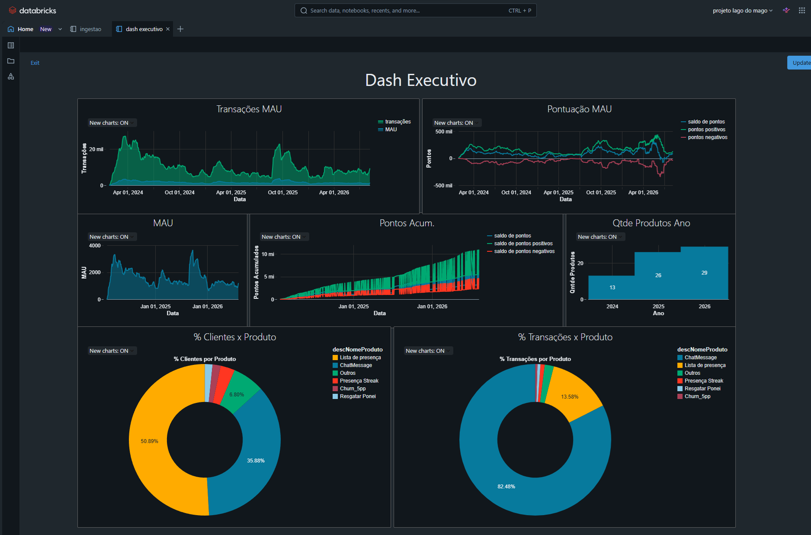

# 🧙 Lago do Mago

## Data Lake & Lakehouse na AWS + Databricks

Projeto de engenharia de dados desenvolvido a partir do curso do [Teo Me Why](https://github.com/TeoMeWhy/lago-mago), com implementação e adaptações realizadas durante o acompanhamento do curso.

### Arquitetura

```
      ┌─────────────────┐
      │ SISTEMA DE      │
      │ ORIGEM          │
      └────────┬────────┘
               │
              CDC
               ▼
            ┌──────┐
            │ RAW  │
            └──┬───┘
               │
        Auto Loader
               │
           Streaming
               ▼
         ┌───────────┐
         │  BRONZE   │
         └─────┬─────┘
               │
              CDF
               │
           Streaming
               ▼
         ┌───────────┐
         │  SILVER   │
         └─────┬─────┘
               │
      regras analíticas
               │
               ▼
         ┌───────────┐
         │   GOLD    │
         └─────┬─────┘
               │
   ┌───────────┴───────────┐
   │                       │
DAILY                   MONTHLY
   │                       │
   └───────────┬───────────┘
               │
          CUBOS / SQL
               │
               ▼
      DASH EXECUTIVO
               │
               ▼
           NEGÓCIO
```

O job `upsell` orquestra as tarefas de cada camada, levando os dados de clientes, transações e produtos por transação do bronze até os relatórios gold diário e mensal.



A linhagem de `gold.upsell.monthly_report` mostra o caminho completo, desde os volumes brutos (`cdc` e `full_load`) até as tabelas silver que alimentam o relatório mensal.



### Relatório Executivo

Na camada gold, a query `daily_report.sql` agrega transações, clientes e pontos por produto e por dia, usando `GROUPING SETS` para gerar também o total diário sem quebra por produto.



O dashboard consome as tabelas gold para acompanhar MAU, transações, saldo de pontos e a distribuição de clientes e transações por produto ao longo do tempo.



O dashboard final conta com visualizações de:

- Transações MAU
- MAU (Monthly Active Users)
- Pontuação MAU
- Pontos Acumulados
- Qtde. Produtos por Ano
- % Clientes x Produto
- % Transações x Produto

### Tecnologias

`AWS` · `Databricks` · `Delta Lake` · `Apache Spark` · `Python` · `SQL` · `GitHub Actions`

### Objetivo

Demonstrar, na prática, a construção de um pipeline de dados moderno, incremental e automatizado, desde a ingestão até a disponibilização de informações para análise e tomada de decisão.
